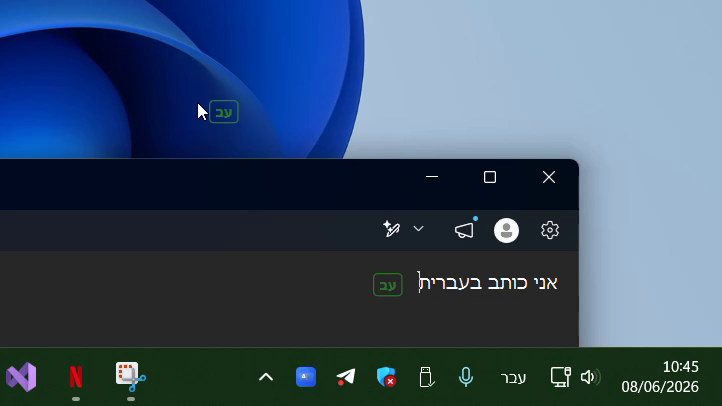
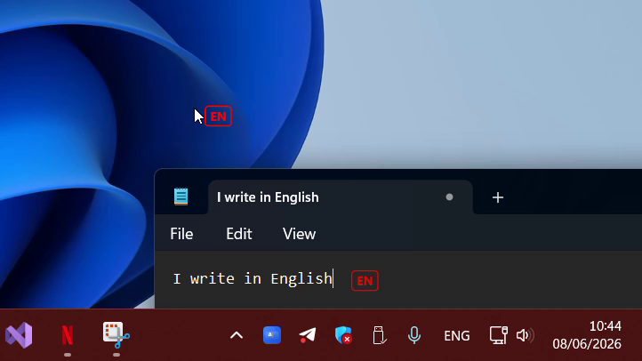

<div align="center">


# OopsType

**תפסיק לגלות מאוחר מדי שהקלדת בשפה הלא נכונה** 🎯
<br/>
<sub><em>Stop discovering — one paragraph too late — that you were typing in the wrong language.</em></sub>

<br/>


### [⬇️ הורדה / Download](https://github.com/ori-halevi/OopsType/releases)

📖 [עברית](#-עברית) · [English](#-english)

<br/>

<table>
<tr>
<td align="center"><br/><sub>🟢 עברית — סמן, עכבר ופס שורת־משימות בירוק</sub></td>
<td align="center"><br/><sub>🔴 אנגלית — סמן, עכבר ופס שורת־משימות באדום</sub></td>
</tr>
</table>

</div>

<br/>

<a name="-עברית"></a>
<div dir="rtl">

## 🇮🇱 עברית

> ♻️ **היורש הרשמי של [taskbar-color-change-by-lang](https://github.com/ori-halevi/taskbar-color-change-by-lang)** — OopsType הוא כתיבה מחדש מאפס שלוקחת את הרעיון של "צבע בשורת המשימות לפי שפה" והופכת אותו לכלי שלם: לא רק פס בשורת המשימות, אלא גם תווית ליד הסמן, תווית שעוקבת אחרי העכבר, איפוס אוטומטי בחוסר פעילות, וממשק רב־לשוני.

### למה זה קיים

כמה פעמים זה קרה לך? את/ה לוחצ/ת על תיבת טקסט, מקליד/ה משפט שלם, מרים/ה את העיניים — וכל הפסקה יצאה ג׳יבריש, כי כל הזמן הזה היית בפריסת מקלדת לא נכונה. אז מוחקים, מחליפים שפה, ומקלידים הכול מחדש. שוב.

החיווי של Windows יושב בתג זעיר במגש המערכת — מקום שאף אחד לא באמת מסתכל עליו תוך כדי הקלדה. **OopsType** פותר את זה בגישה אחת פשוטה: הוא שם את חיווי השפה **בדיוק איפה שהעיניים שלך כבר נמצאות** — ליד הסמן, ליד העכבר, וכפס צבעוני לאורך שורת המשימות שאפשר לראות מקצה החדר.

מי שמחליף בין עברית/אנגלית, רוסית/אנגלית או כל צמד שפות עשרות פעמים ביום — יבין תוך שנייה. וחבל שלא הכרת את זה אתמול. 🙂

### ✨ מה זה עושה

OopsType כולל **ארבע שכבות־על עצמאיות** — מדליקים רק את מה שרוצים, מכבים את השאר.

| | תכונה | מה היא עושה |
|:---:|---|---|
| 🏷️ | **תווית סמן** *(Caret label)* | צ׳יפ זעיר שמרחף מעל הסמן בכל אפליקציה שבפוקוס ומציג את השפה הפעילה (`EN`, `עב`, `РУ`). מסתתר אוטומטית מעל תפריטים וטולטיפים. משתמש ב־`GUITHREADINFO` של Windows, ונופל חזרה ל־UI Automation עבור אפליקציות בלי סמן Win32 קלאסי. |
| 🖱️ | **תווית עכבר** *(Mouse label)* | צ׳יפ קטן שעוקב אחרי הסמן — מושלם לאפליקציות בלי סמן טקסט גלוי (דפי אינטרנט, IDE-ים). מצב **חיסכון** (ברירת מחדל) לא עובד בכלל כשהעכבר במנוחה; מצב **חלקות מקסימלית** מעט מהיר יותר על חשבון פעילות רקע. |
| 🎨 | **פס צבע בשורת המשימות** *(Taskbar strip)* | פס בצבע שהקצית לשפה הפעילה, נצבע מעל (או מאחורי) שורת המשימות. נראה אפילו בראייה ההיקפית. עובי מתכוונן (3px ועד גובה מלא), עיגון עליון/תחתון, וסדר־Z לפני או מאחורי האייקונים. |
| ⏱️ | **איפוס בחוסר פעילות** *(Idle reset)* | אחרי N שניות בלי הקשות — מחזיר אוטומטית את החלון לשפת יעד (למשל תמיד חזרה לאנגלית כשקמת מהמחשב). תנועת עכבר לא מאפסת את הטיימר; רק הקשות אמיתיות. |
| 🌐 | **ממשק רב־לשוני** | חלון ההגדרות ותפריט המגש מתורגמים דרך קובצי JSON פשוטים. בחירת שפה מ־**כללי → שפת היישום** מוחלת מיד, כולל היפוך RTL לשפות מימין־לשמאל. |

> 🎨 כל הצבעים מתכווננים — בצילומים למעלה עברית הוקצתה לירוק ואנגלית לאדום, אבל אתה בוחר.

### 🚀 התקנה

#### ⬇️ הורדה מהירה *(מומלץ)*

1. גשו ל־[**עמוד ה־Releases**](https://github.com/ori-halevi/OopsType/releases).
2. הורידו את ה־`OopsType.exe` מהשחרור האחרון.
3. הפעילו בלחיצה כפולה. זהו — אין מתקין, אין התקנות נלוות, אייקון קטן פשוט מופיע במגש המערכת.

> 💡 ה־`.exe` שמשוחרר הוא קובץ יחיד ועצמאי (self-contained) — לא צריך להתקין שום דבר נוסף, גם לא את ה־.NET Runtime.

#### 🛠️ מהקוד

**דרישות:** Windows 10 / 11 · [.NET 9 Desktop Runtime](https://dotnet.microsoft.com/download/dotnet/9.0).

מתוך הקוד:

```powershell
git clone https://github.com/ori-halevi/OopsType.git
cd OopsType
dotnet build -c Release
```

לקובץ `.exe` נייד יחיד (בלי צורך ב־Runtime מותקן):

```powershell
dotnet publish -c Release -r win-x64 --self-contained true `
  -p:PublishSingleFile=true -p:IncludeNativeLibrariesForSelfExtract=true
```

הפלט יושב ב־`bin\Release\net9.0-windows\win-x64\publish\OopsType.exe`. מעתיקים לכל מקום — אין מתקין, אין שאריות.

**הפעלה עם Windows:** מדליקים **כללי → הפעלה בעליית Windows**. נכתבת רשומה תחת `HKCU\…\Run` — בלי הרשאות מנהל, בלי מתקין. ההגדרות נשמרות ב־`%LOCALAPPDATA%\OopsType\settings.json`.

### 🖱️ שימוש

מפעילים את `OopsType.exe`, ואייקון קטן מופיע במגש המערכת.

| פעולה | איך |
|---|---|
| פתיחת הגדרות | לחיצה כפולה על האייקון, או קליק ימני ← **Settings…** |
| הדלקה/כיבוי מהיר של שכבה | קליק ימני על המגש ← סימון **Caret / Mouse / Taskbar / Idle reset** |
| יציאה | קליק ימני ← **Quit** |

חלון ההגדרות כולל **תצוגה מקדימה חיה** לכל שכבה — מכוונים מרווחים, גופנים וצבעים ורואים את התוצאה מיד, בלי לשמור.

### 🌍 הוספת שפה

OopsType מגלה חבילות שפה בהפעלה משתי תיקיות: `<תיקיית ה־exe>\Languages\` (חבילות מובנות) ו־`%LOCALAPPDATA%\OopsType\Languages\` (שלך — מנצח בהתנגשות). זורקים קובץ JSON אחד והוא מופיע בבורר השפות בהפעלה הבאה. מפתחות חסרים נופלים אוטומטית לערך האנגלי, כך שתרגום חלקי תקף לחלוטין. הפורמט המלא מתואר ב[קטע האנגלי](#adding-a-translation) למטה.

</div>

<br/>

---

<a name="-english"></a>

## 🇬🇧 English

> ♻️ **OopsType is the successor to [taskbar-color-change-by-lang](https://github.com/ori-halevi/taskbar-color-change-by-lang)** — a from-scratch rewrite that takes the "color the taskbar by language" idea and grows it into a complete tool: not just a taskbar strip, but a caret label, a mouse-following label, idle reset, and a multi-language UI.

**OopsType** is a lightweight Windows tray utility that gives you an unmissable, glanceable indication of your active keyboard layout — exactly where your eyes already are. No more typing a full sentence before realizing you were in the wrong layout the whole time.

Built with WPF on .NET 9 (Windows) and the [WPF-UI](https://github.com/lepoco/wpfui) Fluent design system.

### Why this exists

Windows shows the current keyboard layout in a tiny tray badge that nobody actually looks at while typing. If you switch between Hebrew/English, Russian/English, Greek/English (or any pair) dozens of times a day, you've felt the pain: you focus a textbox, start typing, glance up — and realize the last paragraph is gibberish.

OopsType solves this by putting the layout indicator **where your attention already is**: next to your caret, next to your mouse, and along the edge of your taskbar as a colored strip you can see from across the room.

### Features

OopsType ships four independent overlays you can mix and match — turn on only what you want.

**1. Caret label** — a tiny floating chip that hovers above your text caret in whatever app currently has focus, showing the active layout (e.g. `EN`, `עב`, `РУ`). It hides automatically over menus, tooltips and other places a caret would be a lie. Uses Windows `GUITHREADINFO` first, then falls back to UI Automation's `TextPattern` for apps that don't expose a Win32 caret.

**2. Mouse label** — a small chip that follows your mouse cursor. Useful in apps without a visible text caret (web pages, IDEs with custom carets, etc.). Two tracking modes:
- **Economy** *(default)*: zero work while the cursor is at rest. A low-level mouse hook wakes the render loop on motion; it goes back to idle ~150 ms after the cursor stops. Recommended for laptops.
- **Max-smoothness**: keeps the per-frame compositor subscription alive permanently. Marginally snappier first-frame response, at the cost of constant background activity.

Also respects cursor-hide events (video players, touch input) — when Windows hides the cursor, the label hides with it.

**3. Taskbar color strip** — a colored bar painted over (or behind) your taskbar in the color you assigned to the active layout. Glanceable from across the screen, even in your peripheral vision. Fully configurable:
- Thickness: small (3 px) / medium / large / **full** (entire taskbar height)
- Vertical anchor: top or bottom of the taskbar
- Z-order: in front of taskbar icons, or behind them (lets the Windows 11 acrylic blur the color subtly into the bar)
- Opacity: independently toggleable

**4. Idle reset** — optional auto-revert: after N seconds without keypresses, switch the focused window's layout to a target language (e.g. always back to English when you walk away). One-shot per idle stretch — it won't fight you while you continue to idle. Mouse movement doesn't reset the timer; only real keystrokes do.

**5. Multi-language UI** — the settings window and tray menu are translatable via plain JSON files. Pick a language from **General → Application language**; switching applies live, including right-to-left layout flip for RTL languages. Adding a new language is a no-code, no-rebuild operation — see [Adding a translation](#adding-a-translation) below.

### Installing

#### ⬇️ Quick download *(recommended)*

1. Head to the [**Releases page**](https://github.com/ori-halevi/OopsType/releases).
2. Download `OopsType.exe` from the latest release.
3. Double-click to run. That's it — no installer, no setup, just a small icon in your system tray.

> 💡 The released `.exe` is a single, self-contained file — you don't need to install anything else, not even the .NET runtime.

#### 🛠️ From source

**Requirements:** Windows 10 / 11 · [.NET 9 Desktop Runtime](https://dotnet.microsoft.com/download/dotnet/9.0).

From source:
```powershell
git clone https://github.com/ori-halevi/OopsType.git
cd OopsType
dotnet build -c Release
```

To produce a portable single-file `.exe`:
```powershell
dotnet publish -c Release -r win-x64 --self-contained true `
  -p:PublishSingleFile=true -p:IncludeNativeLibrariesForSelfExtract=true
```

The output ends up in `bin\Release\net9.0-windows\win-x64\publish\OopsType.exe`. Copy it anywhere; it has no installer.

**Autostart with Windows:** enable **General → Launch on Windows startup** in the settings window. OopsType writes an entry under `HKCU\Software\Microsoft\Windows\CurrentVersion\Run` — no admin rights needed, no installer state. Settings are stored at `%LOCALAPPDATA%\OopsType\settings.json`.

### Usage

Launch `OopsType.exe`. A small tray icon appears in the notification area.

| Action | How |
|---|---|
| Open settings | Double-click the tray icon, or right-click → **Settings…** |
| Quickly toggle an overlay | Right-click tray → check/uncheck **Caret label / Mouse label / Taskbar strip / Idle reset** |
| Quit | Right-click tray → **Quit** |

The settings window has a live preview for every overlay, so you can dial in offsets, fonts and colors and see the result immediately without saving.

### Adding a translation

OopsType discovers language packs at startup from two folders. Drop a JSON file in either one and it shows up in **General → Application language** the next time you launch.

**Discovery folders**
1. `<OopsType.exe folder>\Languages\` — packs that ship with the install.
2. `%LOCALAPPDATA%\OopsType\Languages\` — your own packs. Useful when OopsType is installed in a read-only location (e.g. Program Files), or when you want to override a built-in pack. Duplicates here win.

**File format** — each file is a single JSON document. Filename is cosmetic (any name works); the `code` field is the identifier that's persisted to `settings.json`.

```json
{
  "code": "fr",
  "name": "French",
  "nativeName": "Français",
  "flowDirection": "LeftToRight",
  "strings": {
    "Window_Title": "OopsType — Paramètres",
    "Nav_CaretLabel": "Étiquette du curseur",
    "...": "..."
  }
}
```

- `code` — short identifier (ISO-style, lowercase). What gets saved in settings.
- `name` — neutral display name shown in the chooser.
- `nativeName` — name in the language's own script. Shown in the chooser as the primary label.
- `flowDirection` — `"LeftToRight"` (default) or `"RightToLeft"`. Drives the settings window's text direction.
- `strings` — translation table. Use `Languages\en.json` as the canonical key list.

**Fallback behavior** — any key missing from your pack falls back to the English value automatically, so partial translations are valid. If a key is missing from English too, the raw key name is shown so it's obvious in the UI rather than silently blank.

### Architecture

OopsType is organized as a small, dependency-injected WPF app (Prism.Unity container). Each concern lives in its own class so behavior can be reasoned about — and toggled — in isolation.

```
App.xaml.cs                      ── composition root (DI registration)
└── ApplicationLifecycle         ── orchestrates start/stop in order

Services/
├── KeyboardLayoutService        ── tracks foreground HKL via WinEvent hook + 80 ms poll
├── KeyboardActivityService      ── low-level keyboard hook → KeyPressed event + LastKeyTimeUtc
├── CaretLocationService         ── GUITHREADINFO → UI Automation TextPattern fallback
├── TaskbarService               ── locates the primary Shell_TrayWnd rect
├── IdleResetService             ── 1 Hz tick; reverts layout when idle > threshold
├── SettingsService              ── JSON persistence (tmp-then-rename), Changed event
├── StartupService               ── HKCU\…\Run autostart toggle
├── TransparencyDetector         ── reads Win11 acrylic preference for first-run defaults
├── LocaleResolver               ── HKL → native-script label (en→"EN", he→"עב", ja→"日本")
├── Localization/
│   └── LocalizationService      ── discovers Languages\*.json, swaps the active ResourceDictionary,
│                                   raises LanguageChanged for WinForms-side consumers (tray menu)
└── Overlays/
    ├── CaretOverlayPresenter         ── owns + positions caret chip; 120 ms follow loop
    ├── MouseOverlayPresenter         ── hook-wakes-Rendering pattern (see file header)
    └── TaskbarStripOverlayPresenter  ── repositions on heartbeat when the taskbar moves

Native/
├── LowLevelKeyboardHook        ── WH_KEYBOARD_LL
├── LowLevelMouseHook           ── WH_MOUSE_LL
├── WinEventHook                ── SetWinEventHook for foreground/focus
└── NativeMethods               ── all P/Invoke signatures

Views/                           ── per-overlay WPF windows + the Fluent settings window
ViewModels/                      ── settings + per-overlay VMs (INotifyPropertyChanged)
Infrastructure/                  ── ILogger, IErrorReporter, IToastService, Safe.Invoke
```

**Design notes**
- **No main window.** Every window — overlays and the settings dialog — is created on demand. `App.CreateShell()` returns `null` and `ShutdownMode="OnExplicitShutdown"` keeps the process alive in the tray.
- **One shared heartbeat.** `OverlayCoordinator` runs a single 1.5 s `DispatcherTimer` and ticks all three presenters, instead of each owning its own. Keeps idle CPU near zero.
- **Hook callbacks never throw.** Every low-level hook delegate is wrapped in `Safe.Invoke` so a buggy subscriber can't degrade the global hook chain (Windows enforces `LowLevelHooksTimeout` — a slow callback gets you uninstalled).
- **Mouse overlay: hook-wakes-Rendering.** The cursor-follow chip used to run on a 40 Hz `DispatcherTimer`, which produced visible jitter because it wasn't synchronized to the WPF compositor. Now a low-level mouse hook just marks "moved" and subscribes the window to `CompositionTarget.Rendering`; window moves happen once per frame, frame-synchronous. After 150 ms idle the Rendering subscription is dropped — true zero-work idle.
- **Crash-resilient settings I/O.** `SettingsService.WriteToDisk` writes to `settings.json.tmp` then atomically `File.Move(..., overwrite: true)` so a crash mid-write can't leave a truncated config.
- **Global exception handlers.** `App.WireGlobalExceptionHandlers` catches `DispatcherUnhandledException`, `AppDomain.UnhandledException`, and `TaskScheduler.UnobservedTaskException`. Errors are logged AND surfaced as a tray toast — silent failures in a long-running utility are the worst kind.

### Tech stack

- **.NET 9** (`net9.0-windows`), WPF + WinForms interop (the tray icon uses `System.Windows.Forms.NotifyIcon`)
- **[Prism.Unity](https://github.com/PrismLibrary/Prism) 9.0** — DI container and `PrismApplication` host
- **[WPF-UI](https://github.com/lepoco/wpfui) 4.0** — Fluent / Mica visuals for the settings window
- **Win32 P/Invoke** — `user32`, `kernel32`, `advapi32` for hooks, foreground tracking, layout switching, and the Run registry key
- **UI Automation** — fallback caret detection in apps without a classical Win32 caret

No telemetry. No network calls. No third-party services. Everything runs locally.

### Contributing

Issues and PRs are welcome at [github.com/ori-halevi/OopsType](https://github.com/ori-halevi/OopsType). A few notes:

- The codebase favors small, single-responsibility classes coordinated through interfaces — please keep that style when adding features.
- Anything running on a hook callback thread (`LowLevelKeyboardHook`, `LowLevelMouseHook`, `WinEventHook`) **must** be wrapped in `Safe.Invoke` and must do the minimum amount of work possible.
- New settings go into `Models/AppSettings.cs`; per-feature defaults belong in `SettingsService.ApplyFirstRunDefaults` if they should adapt to system state.

### License

Apache License 2.0 — see [LICENSE](LICENSE).
